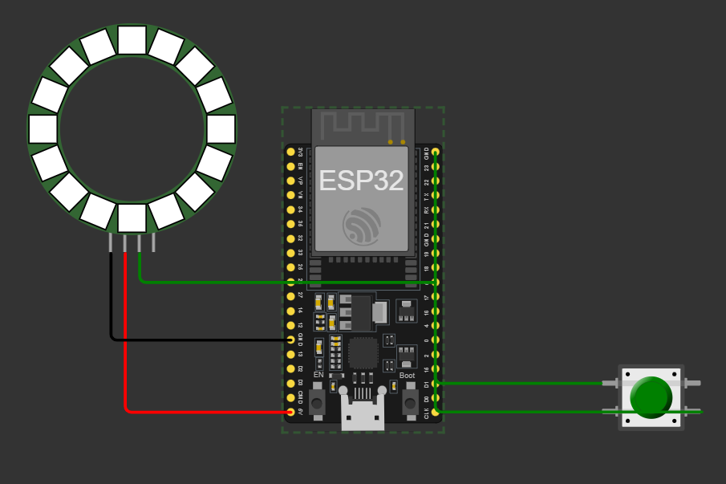
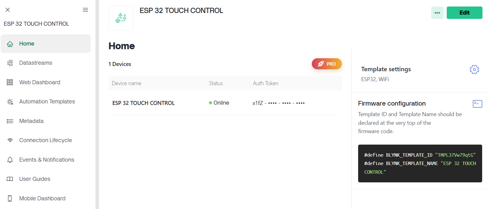
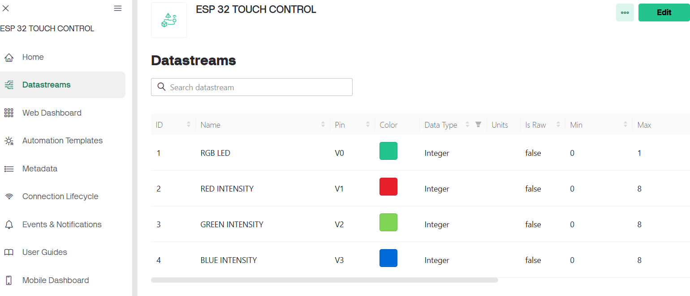
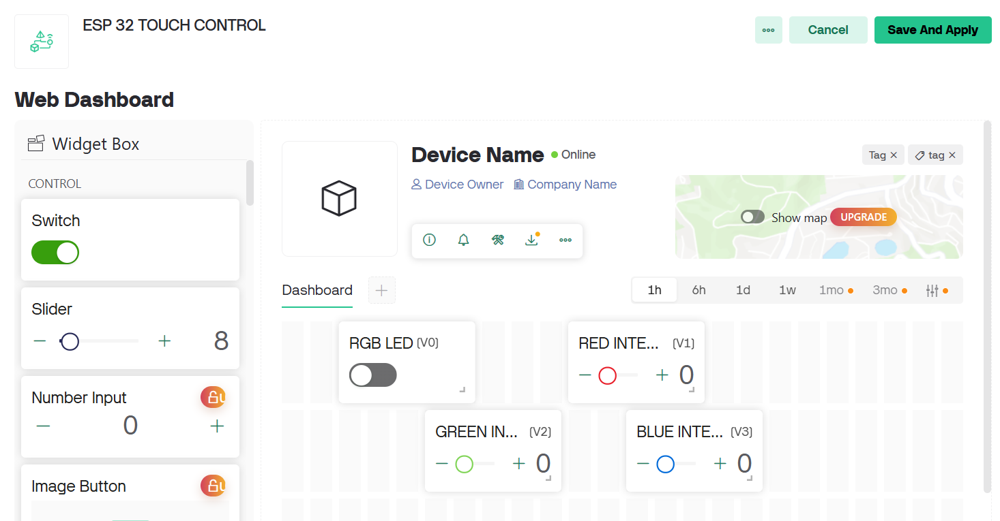
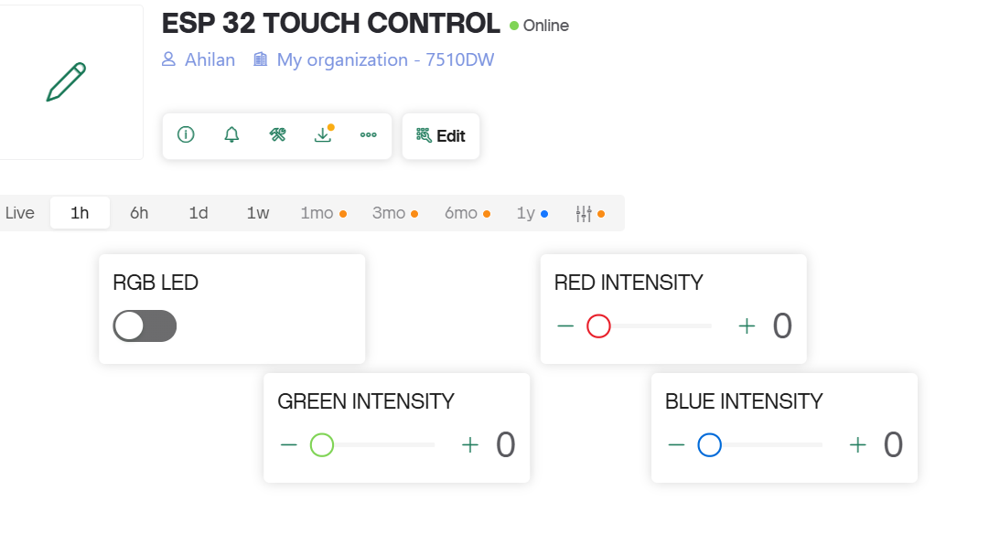
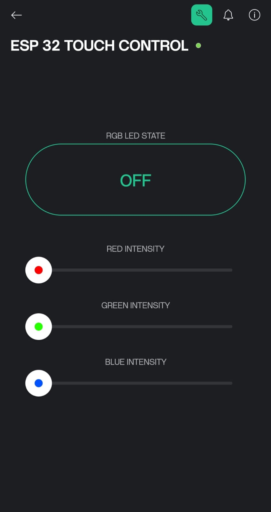

# <center><b><font color="yellow">RGB NEOPIXEL LED PROJECT</font>

### **<font color="lighblue">TABLE OF CONTENTS :</font>**
<ol>
<li><a href="#overview">Overview</a></li>
<li><a href="#hardware-components">Hardware components</a></li>
<li><a href="#code">Code</a></li>
<li><a href="#circuit-diagram">Circuit diagram</a></li>
<li><a href="#blynk-web-app-setup">Blynk web app setup</a></li>
<li><a href="#blynk-user-interface">Blynk user interface</a></li>
<li><a href="#notes">Notes</a></li>
<li><a href="#modifications">Modifications</a></li>
<li><a href="#demo-video">Demo video</a></li>
</ol>

> ## <b><i><font color="lighblue">OVERVIEW</font>

**This project uses an <mark>ESP32 microcontroller integrated with a TTP223 touch sensor and a NeoPixel RGB LED ring</mark>, all controlled through the <mark>Blynk IoT app</mark>. The LEDs can be turned on or off either by touching the sensor or using a virtual switch in the app, with both methods kept in sync. Additionally, the app includes <mark>three slider widgets to adjust the Red, Green, and Blue color intensities of the LEDs</mark> in real-time applying only when the LEDs are on. <mark>This setup provides a simple, interactive smart lighting system that combines physical touch and remote app control</mark>.**

> ## <b><i><font color="lighblue">HARDWARE COMPONENTS</font>
<ul>
<li><b>ESP 32 (ESP 32 Dev Module)</b></li>
<li><b>TTP 223 Capacitive touch sensor module (<mark>KY 036 module as alternative</mark>)</b></li>
<li><b>Circular Neopixel RGB (24/16/35)<</b></li>
<li><b>Breadboard (if needed)</b></li>
<li><b>Jumper wires</b></li>
</ul>

> ## <b><i><font color="lighblue">CODE</font>

**Code can be written in <mark>Arduino IDE/C++</mark> or any other compatible software.**

```cpp
#define BLYNK_TEMPLATE_ID "Enter_Template_ID"
#define BLYNK_TEMPLATE_NAME "Enter_Template_Name"
#define BLYNK_AUTH_TOKEN "Enter_char_auth_token"

#include <Adafruit_NeoPixel.h>
#include <WiFi.h>
#include <BlynkSimpleEsp32.h>

char ssid[] = "WiFi_ssid";
char pass[] = "WiFi_password";

#define TOUCH_PIN     15
#define LED_PIN       5
#define NUM_LEDS      24

#define BLYNK_SWITCH  V0
#define RED_SLIDER    V1
#define GREEN_SLIDER  V2
#define BLUE_SLIDER   V3

Adafruit_NeoPixel strip(NUM_LEDS, LED_PIN, NEO_GRB + NEO_KHZ800);

bool appSwitchState = false;
bool lastTouchState = false;
int red = 0, green = 0, blue = 255;
void setup() {
  Serial.begin(115200);
  pinMode(TOUCH_PIN, INPUT);

  strip.begin();
  strip.show(); 

  Blynk.begin(BLYNK_AUTH_TOKEN, ssid, pass);

  Blynk.syncVirtual(RED_SLIDER, GREEN_SLIDER, BLUE_SLIDER, BLYNK_SWITCH);
}

BLYNK_WRITE(BLYNK_SWITCH) {
  appSwitchState = param.asInt();
  if (appSwitchState) {
    updateLEDs();
  } else {
    turnOffLEDs();
  }
}

BLYNK_WRITE(RED_SLIDER) {
  red = param.asInt();
  if (appSwitchState) updateLEDs();
}

BLYNK_WRITE(GREEN_SLIDER) {
  green = param.asInt();
  if (appSwitchState) updateLEDs();
}

BLYNK_WRITE(BLUE_SLIDER) {
  blue = param.asInt();
  if (appSwitchState) updateLEDs();
}

void loop() {
  Blynk.run();

  bool touchDetected = digitalRead(TOUCH_PIN) == HIGH;

  if (touchDetected != lastTouchState) {
    lastTouchState = touchDetected;
    appSwitchState = touchDetected;
    Blynk.virtualWrite(BLYNK_SWITCH, appSwitchState);

    if (appSwitchState) {
      updateLEDs();
    } else {
      turnOffLEDs();
    }
  }
}

void updateLEDs() {
  for (int i = 0; i < NUM_LEDS; i++) {
    strip.setPixelColor(i, strip.Color(red, green, blue));
  }
  strip.show();
}

void turnOffLEDs() {
  for (int i = 0; i < NUM_LEDS; i++) {
    strip.setPixelColor(i, 0);
  }
  strip.show();
}
```

> ## <b><i><font color="lighblue">CIRCUIT DIAGRAM</font>



> ## <b><i><font color="lighblue">BLYNK WEB APP SETUP</font>
- <b><font color="lightgreen">CREATE TEMPLATE</font>



- <b><font color="lightgreen">CREATE DATASTREAMS</font>
  


- <b><font color="lightgreen">SET UP WEB DASHBOARD</font>
  


- <b><font color="lightgreen">DEVICE CREATION</font>



> ## <b><i><font color="lighblue">BLYNK USER INTERFACE</font>



> ## <b><i><font color="lighblue">NOTES</font>

<ul>
<li><mark>A separate library has to be installed and included</mark> in the code for the RGB Neopixel to be enabled and the intensities of the colours can be changed.</li>
<li>ESP 32 digital pin should be connected to the D(in) of the LED and not the D(out).</li>
<li>Use the corresponding virtual pins in the Blynk dashboard as used in the code.</li>
<li>Ensure that the hardware connections are legitimate as shown in the circuit diagram above.</li>
<li>Ensure that the ESP 32 hardware is functioning and choose the corresponding <mark>BOARD and PORT</mark> in the Arduino IDE.</li>
<li>Use an USB cable that transmits both power and data to the ESP 32 while uploading the code.</li>
</ul>

> ## <b><i><font color="lighblue">MODIFICATIONS</font>

<ul>
<li><mark>A PIR motion sensor (HC-SR501 Module)</mark> can be used instead of a touch sensor to enable the LED to switch on when motion is detected.</li>
</ul>

> ## <b><i><font color="lighblue">DEMO VIDEO</font>

<b>TO VIEW DEMO VIDEO --></b> [<ins>Click here</ins>](video.mp4)

